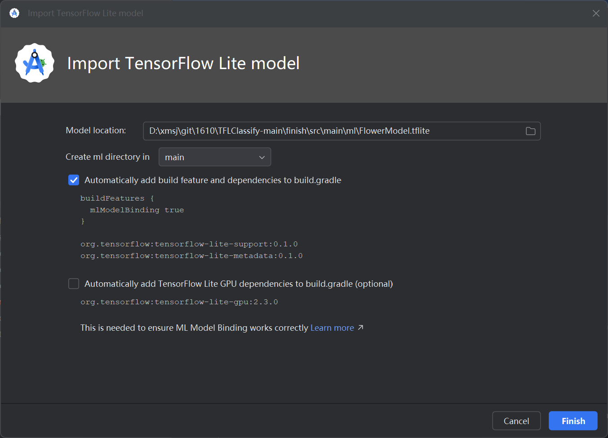
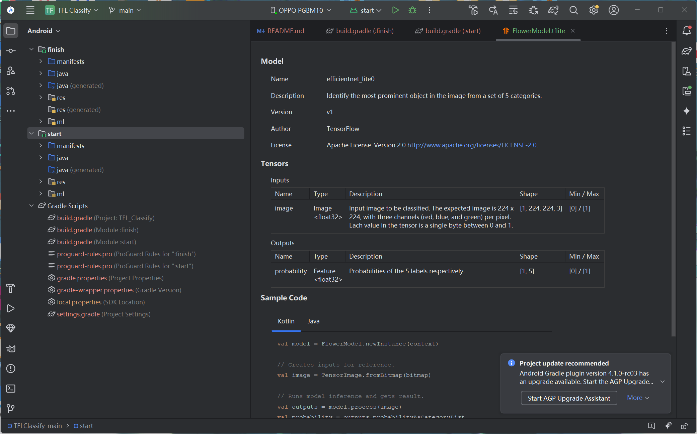
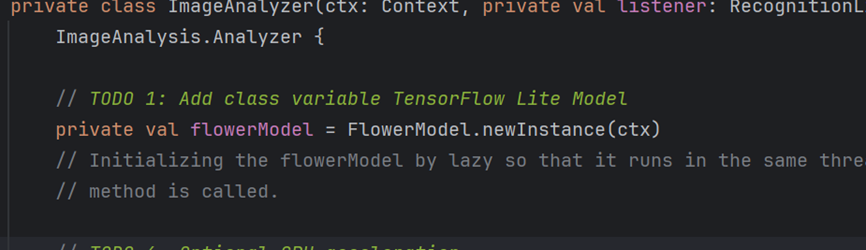
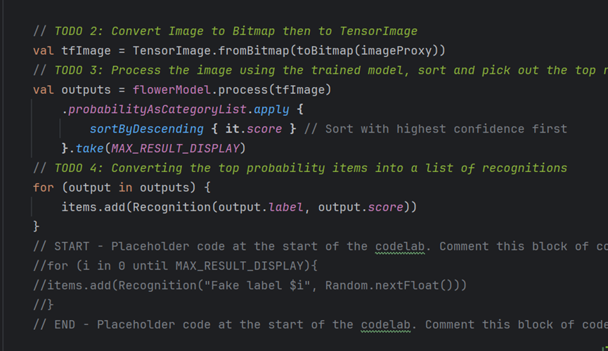
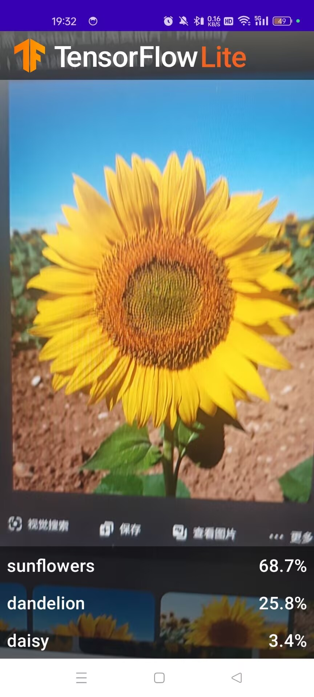
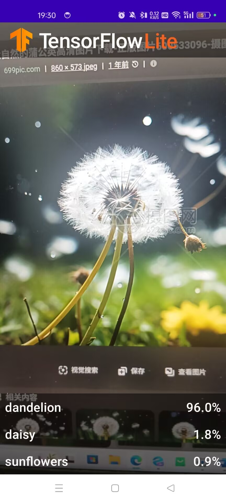
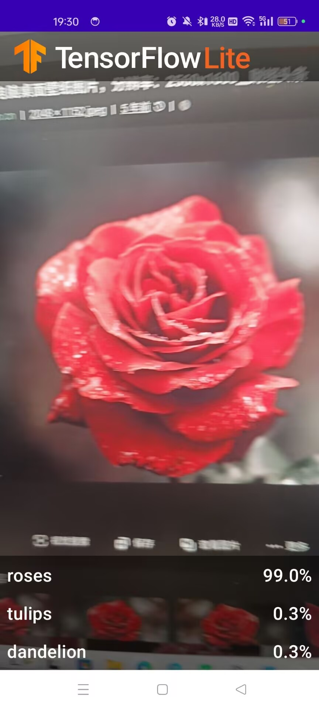
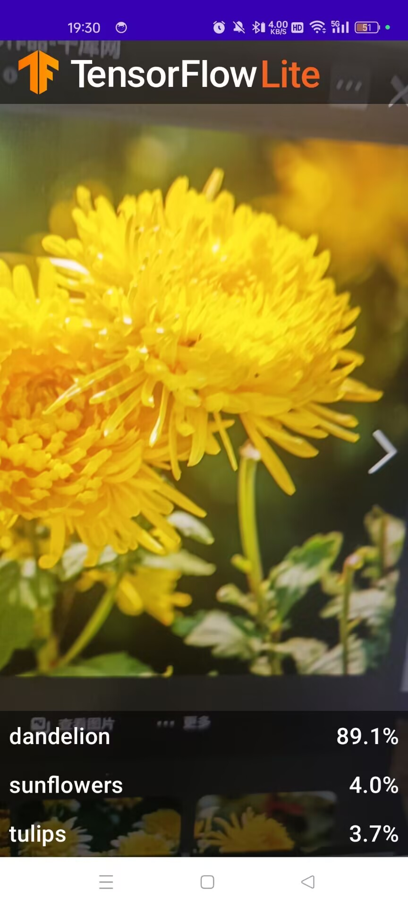

# 实现智能图像分类APP

## 实验报告

### 学生信息
- **姓名**：杨瑞权
- **学号**：121052022077

### 实验课程
- **课程名称**：软件项目研发实践
- **实验项目**：实现智能图像分类APP
- **实验日期**：2025年5月21日

## 实验目的
通过本实验，掌握如何在Android平台上实现一个智能图像分类应用，包括环境搭建、模型导入、代码实现及应用部署。

## 实验环境
- **硬件**：Windows 11
- **软件**：
  - Android Studio 4.1 及以上版本
  - GitHub

## 实验内容

### 项目描述
本项目的目标是实现一个基于TensorFlow Lite的智能图像分类应用，能够识别花卉图像。主要步骤包括：
1. 安装 Android Studio 4.1 及以上版本。
2. 下载代码 ZIP 文件或使用 `git clone` 克隆代码。
3. 按照教程完成所有 TODO 代码项。
4. 导入已有的 TensorFlow Lite 模型（位于 `finish` 模块的 `ml` 文件夹下的 `FlowerModel.tflite`）。
5. 在真机上运行完成的花卉识别应用。
6. 将代码上传至 GitHub，并撰写详细的 README 文档。

## 实验步骤

### 创建项目
1. 安装 Android Studio 4.1 或更高版本。
2. 打开 Android Studio，选择 **“Open an Existing Project”**，选择下载的代码文件夹。
3. 确保项目包含两个模块：`start` 和 `finish`。

### 添加项目模型
1. 选择 `start` 模块。
2. 右键单击 `start` 模块，选择 **`New > Other > TensorFlow Lite Model`**。
3. 选择 `finish` 模块中 `ml` 文件夹下的 `FlowerModel.tflite` 文件。
4. 点击 **“Finish”**，系统将自动下载模型依赖并添加到 `build.gradle` 文件中。

### 添加 TODO 项
在 `start` 模块的代码中，完成以下 TODO 项：
1. 初始化 TensorFlow Lite 模型。
2. 将摄像头输入的图像转换为模型所需的格式。
3. 使用模型进行图像分类，并处理输出结果。
4. 将分类结果显示在应用界面上。

### 运行 APP
1. 连接真机设备，并确保已启用开发者选项和 USB 调试。
2. 在 Android Studio 中选择真机设备，运行 `start` 模块。
3. 允许应用获取摄像头权限，启动应用后即可实时识别花卉图像。

