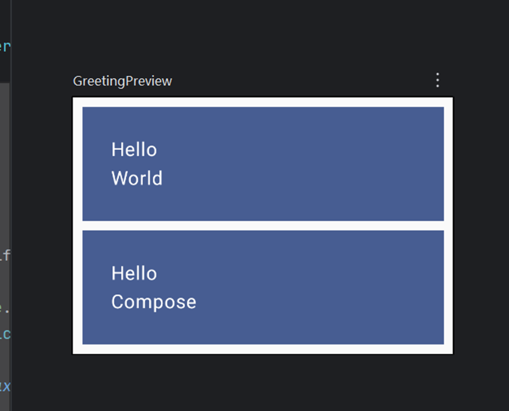

# 实验报告二：构建Kotlin应用并使用Compose布局 & 构建CameraXApp

## 学生信息
- **姓名**：杨瑞权
- **学号**：121052022077
- **实验课程**：软件项目研发实践
- **实验日期**：4.25 - 5.5

## 一、构建Kotlin应用并使用Compose布局

### 实验目的
1. 掌握使用Kotlin语言开发Android的基本流程。
2. 掌握Android Compose布局的基本用法。
3. 进一步熟悉Kotlin语言的特性。

### 实验环境
- **硬件**：Windows 11
- **软件**：Android Studio，GitHub

### 实验内容
- **项目描述**：学习基于Kotlin语言的Android开发。
- **任务**：
  1. 按照教程完成首个Kotlin APP的构建。
  2. 按照教程完成Compose布局的实践。
- **要求**：上传代码至GitHub，并撰写详细的Readme文档。

### 实验步骤
1. **创建项目**  
2. **修改代码添加颜色和内边距**
   
3. **修改代码使子级纵向排列**
   
4. **修改代码更新布局**
   
5. **修改代码添加按钮**
   

## 二、构建CameraXApp

### 实验目的
1. 掌握Android CameraX拍照功能的基本用法。
2. 掌握Android CameraX视频捕捉功能的基本用法。
3. 进一步熟悉Kotlin语言的特性。

### 实验环境
- **硬件**：Windows 11
- **软件**：Android Studio，GitHub

### 实验内容
- **项目描述**：CameraX是Android最新的支持开发相机应用的Jetpack库（API level 21以上）。本实验将按照教程完成CameraX APP的构建。
- **要求**：上传代码至GitHub，并撰写详细的Readme文档。
- **学习内容**：
  - Android中布局的用法
  - Android硬件权限的获取
  - CameraX库的基本用法

### 实验步骤
1. **创建项目**  
2. **添加gradle依赖**  
3. **创建项目布局**  
   - 添加`res/layout/activity_main.xml`的`activity_main`布局文件
   - 更新`res/values/strings.xml`文件
   
4. **编写MainActivity.kt代码**  
   - 在`AndroidManifest.xml`添加必要权限
   
5. **实现Preview用例**  
   - 填充`startCamera()`函数
    
6. **实现ImageCapture用例**  
   - 填充`takePhoto()`方法
   
7. **实现VideoCapture用例**  
   - 填充`captureVideo()`方法

## 实验结论和心得
通过本次实验，掌握了使用 Compose 布局来编排界面，理解了 Compose 布局的简洁性和高效性，能够方便地构建出灵活多变的界面效果。同时，学会了如何构建相机 APP，掌握了相机预览、拍照、录像功能的实现方法，对 Android 开发中的硬件调用和功能实现有了更深入的理解，进一步提升了 Kotlin 语言的编程能力，为后续开发更复杂的 Android 应用奠定了坚实的基础。
